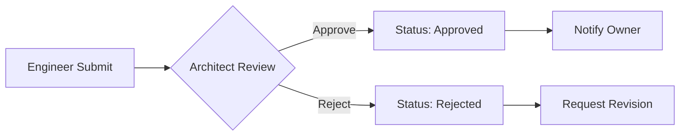
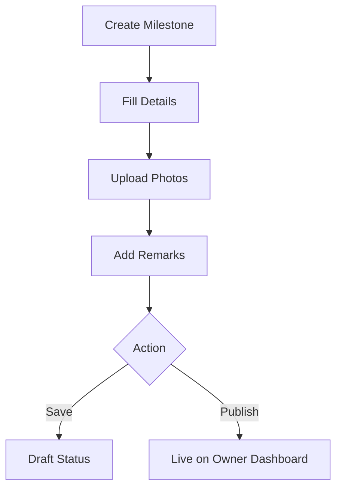
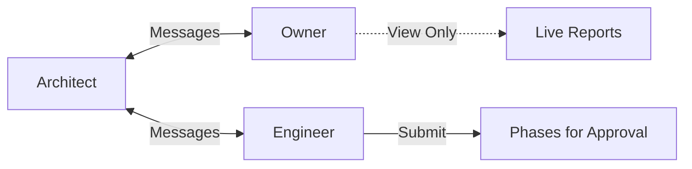

# 📐 Dokumentasi Portal Arsitek - Moorgen Smart Home

## Daftar Isi
1. [Ringkasan](#ringkasan)
2. [Arsitektur Sistem](#arsitektur-sistem)
3. [Halaman-Halaman](#halaman-halaman)
4. [Komponen Layout](#komponen-layout)
5. [Navigasi](#navigasi)
6. [Fitur & Fungsionalitas](#fitur--fungsionalitas)
7. [Design System](#design-system)
8. [Alur Kerja](#alur-kerja)

---

## Ringkasan

Portal Arsitek adalah bagian dari ekosistem **Moorgen Smart Home** yang didesain khusus untuk arsitek profesional. Portal ini menyediakan antarmuka premium untuk:

- 📊 **Manajemen Proyek** - Tracking progress dan validasi fase
- 📝 **Live Reporting** - Pembuatan laporan real-time untuk owner
- 💬 **Komunikasi** - Chat dengan Owner dan Engineer
- 📁 **Resource Management** - Pengelolaan file dan dokumen proyek
- ✅ **Approval Workflow** - Sistem persetujuan bertingkat

### Teknologi yang Digunakan
- **React 18** dengan TypeScript
- **Framer Motion** untuk animasi premium
- **Tailwind CSS** dengan design tokens kustom
- **React Router** untuk navigasi
- **Lucide React** untuk iconography
- **shadcn/ui** untuk komponen UI

---

## Arsitektur Sistem

```
src/
├── components/
│   ├── layout/
│   │   └── ArchitectLayout.tsx      # Layout wrapper utama
│   └── dashboard/
│       ├── ArchitectSidebar.tsx     # Sidebar desktop
│       └── ArchitectMobileNav.tsx   # Navigasi mobile
├── pages/
│   ├── ArchitectDashboard.tsx       # Halaman dashboard utama
│   ├── ArchitectProjectPage.tsx     # Halaman approval proyek
│   ├── ArchitectReportingPage.tsx   # Halaman live reporting
│   ├── ArchitectMessages.tsx        # Halaman pesan/chat
│   └── ArchitectResources.tsx       # Halaman manajemen file
└── components/
    └── FloatingReportButton.tsx     # Tombol akses cepat reporting
```

---

## Halaman-Halaman

### 1. 🏠 Dashboard (`/architect-dashboard`)
**File:** `src/pages/ArchitectDashboard.tsx`

Dashboard utama yang menampilkan overview lengkap proyek arsitek.

#### Komponen Utama:
| Komponen | Deskripsi |
|----------|-----------|
| **Header Greeting** | Sapaan dinamis berdasarkan waktu hari |
| **Top Cards (4x)** | Statistik: Active Projects, Pending Validations, Shared Files, Next Field Sync |
| **Project Journey** | Timeline vertikal dengan progress fase-fase proyek |
| **Quick Chat** | Tab untuk komunikasi cepat dengan Owner/Engineer |
| **Resources Panel** | Akses cepat ke file-file proyek |

#### State Management:
```typescript
interface Phase {
  id: string;
  title: string;
  status: "completed" | "in-progress" | "pending";
  date: string;
  description: string;
  validated: boolean;
  progress?: number;
}

const [phases, setPhases] = useState<Phase[]>(initialPhases);
const [expandedPhases, setExpandedPhases] = useState<string[]>(["3"]);
const [chatTab, setChatTab] = useState<"owner" | "engineer">("owner");
```

#### Fitur Interaktif:
- ✅ Toggle ekspansi fase
- ✅ Validasi fase dengan toast notification
- ✅ Hover effects dengan animasi
- ✅ Chat dual-tab (Owner/Engineer)

---

### 2. 📋 Approval Project (`/architect-project`)
**File:** `src/pages/ArchitectProjectPage.tsx`

Halaman untuk review dan approval submission dari engineer.

#### Summary Cards (2x2 Grid):
| Card | Value | Deskripsi |
|------|-------|-----------|
| Project Health | 85% | Progress ring animasi |
| Days to Handover | 45 | Countdown ke deadline |
| Pending Approvals | 2 | Item yang butuh action |
| Next Inspection | Tomorrow | Jadwal inspeksi berikutnya |

#### Workflow Approval:
```
Engineer Submit → Architect Review → Approve/Reject → Notify Owner
```

#### Status Fase:
| Status | Visual | Badge |
|--------|--------|-------|
| `approved` | ✅ Hijau | "Approved" |
| `pending-approval` | ⏳ Gold (pulse) | "Pending Approval" |
| `rejected` | ❌ Merah | "Rejected" |
| `pending` | ⚪ Abu-abu | "Not Submitted" |

#### Actions:
```typescript
const handleApprove = (phaseId: string) => { ... };
const handleReject = (phaseId: string) => { ... };
```

---

### 3. 📝 Live Reporting (`/architect-reporting`)
**File:** `src/pages/ArchitectReportingPage.tsx`

Canvas kosong untuk membuat laporan progress manual.

#### Interface Milestone:
```typescript
interface Milestone {
  id: string;
  phaseTitle: string;
  targetDate: string;
  description: string;
  status: "pending" | "in-progress" | "completed" | "delayed";
  imageUrl: string | null;
  architectRemark: string;
  isDraft: boolean;
}
```

#### Fitur Utama:
| Fitur | Deskripsi |
|-------|-----------|
| **Add Milestone** | Tombol besar dengan animasi untuk menambah milestone baru |
| **Image Upload** | Upload foto progress dari field |
| **Status Selector** | Dropdown untuk status (Pending/In Progress/Completed/Delayed) |
| **Architect's Remark** | Area teks khusus untuk catatan arsitek |
| **Preview Mode** | Toggle untuk melihat tampilan seperti di Owner Dashboard |
| **Draft/Publish** | Simpan sebagai draft atau publish ke Owner |

#### Dual-Panel Chat:
- Tab Owner: Komunikasi dengan pemilik proyek
- Tab Engineer: Koordinasi dengan tim teknis

#### Actions:
```typescript
const saveDraft = () => { ... };          // Simpan draft
const publishToOwner = () => { ... };     // Publish semua
const publishSingleMilestone = (id) => { ... }; // Publish satu
```

---

### 4. 💬 Messages (`/architect-messages`)
**File:** `src/pages/ArchitectMessages.tsx`

Interface chat premium dengan dua percakapan terpisah.

#### Tab Configuration:
```typescript
type ChatTab = "owner" | "engineer";

interface Message {
  id: string;
  text: string;
  sender: "architect" | "other";
  timestamp: string;
  status?: "sent" | "delivered" | "read";
}
```

#### Fitur Chat:
- ✅ Dual tab (Owner/Engineer)
- ✅ Auto-scroll ke pesan terbaru
- ✅ Status pesan (sent/delivered/read)
- ✅ Quick responses (preset replies)
- ✅ Typing indicator
- ✅ Keyboard shortcuts (Enter to send, Shift+Enter for newline)

#### UI Elements:
- Partner info bar dengan avatar
- Action buttons (call, video, more)
- Attachment dan mic button
- Animasi bubble message

---

### 5. 📁 Resources (`/architect-resources`)
**File:** `src/pages/ArchitectResources.tsx`

Sistem manajemen file untuk blueprint, diagram, dan model 3D.

#### Kategori File:
| Kategori | Icon | Jumlah | Warna |
|----------|------|--------|-------|
| All Files | 📂 | 24 | Gold |
| Documentation | 📖 | 8 | Blue |
| Technical Specs | 🔧 | 6 | Purple |
| Design Assets | 🎨 | 5 | Pink |
| Electrical Plans | ⚡ | 5 | Amber |

#### Interface Resource:
```typescript
interface Resource {
  id: string;
  name: string;
  type: "pdf" | "image" | "spreadsheet" | "document" | "folder";
  size: string;
  modified: string;
  category: string;
  starred: boolean;
}
```

#### View Modes:
- **Grid View**: Card-based layout (5 kolom di desktop)
- **List View**: Tabel dengan sticky header

#### Actions per File:
- 👁️ Preview
- ⬇️ Download
- ⭐ Star/Unstar
- 🔗 Share
- 🗑️ Delete

---

## Komponen Layout

### ArchitectLayout
**File:** `src/components/layout/ArchitectLayout.tsx`

Wrapper utama yang menggabungkan sidebar dan mobile navigation.

```tsx
<div className="min-h-screen bg-[#FAFAFA] flex w-full">
  <ArchitectSidebar />        {/* Desktop only */}
  <main className="flex-1 pb-24 lg:pb-0 overflow-y-auto">
    {children}
  </main>
  <ArchitectMobileNav />      {/* Mobile only */}
</div>
```

### ArchitectSidebar
**File:** `src/components/dashboard/ArchitectSidebar.tsx`

Sidebar desktop dengan navigasi ikon.

#### Nav Items:
| Icon | Label | Path |
|------|-------|------|
| 📊 | Dashboard | `/architect-dashboard` |
| 📁 | Projects | `/architect-project` |
| 📋 | Reporting | `/architect-reporting` |
| 💬 | Messages | `/architect-messages` |
| 📂 | Resources | `/architect-resources` |
| ⚙️ | Settings | `/architect-settings` |

#### Styling:
- Fixed position, centered vertically
- Logo "A" dengan hover glow
- Role label "ARCHITECT"
- Active state dengan gradient dan sparkles
- Tooltip on hover

### ArchitectMobileNav
**File:** `src/components/dashboard/ArchitectMobileNav.tsx`

Bottom navigation bar untuk mobile.

- 5 nav items (tanpa Settings)
- Active indicator dengan layoutId animation
- Safe area padding untuk notch devices

### FloatingReportButton
**File:** `src/components/FloatingReportButton.tsx`

Tombol floating untuk akses cepat ke Live Reporting.

- Tersembunyi di halaman `/architect-reporting`
- Pulse animation dengan ring effect
- Tooltip on hover (desktop only)

---

## Navigasi

### Route Configuration
**File:** `src/components/AnimatedRoutes.tsx`

```tsx
<Route path="/architect-dashboard" element={<ArchitectDashboard />} />
<Route path="/architect-project" element={<ArchitectProjectPage />} />
<Route path="/architect-reporting" element={<ArchitectReportingPage />} />
<Route path="/architect-messages" element={<ArchitectMessages />} />
<Route path="/architect-resources" element={<ArchitectResources />} />
```

### Login Flow
**File:** `src/components/LoginForm.tsx`

Login sebagai partner mengarahkan ke `/architect-dashboard`.

```typescript
// Partner credentials
email: "partner@moorgen.com"
password: "partner123"
```

---

## Fitur & Fungsionalitas

### 1. Phase Validation
```typescript
const handleValidate = (phaseId: string) => {
  setPhases(prev =>
    prev.map(phase =>
      phase.id === phaseId ? { ...phase, validated: true } : phase
    )
  );
  toast.success("Phase validated successfully");
};
```

### 2. Real-time Progress Updates
- Progress bar animasi dengan gradient
- Status icons dengan conditional styling
- Live percentage indicators

### 3. Chat System
- Dual-tab architecture
- Message status tracking
- Quick response templates
- Keyboard navigation

### 4. File Management
- Multi-category filtering
- Search functionality
- Grid/List view toggle
- Star favorites system
- Bulk actions (future)

### 5. Draft/Publish Workflow
- Save as draft
- Preview before publish
- Publish individual or all milestones
- Toast notifications for feedback

---

## Design System

### Warna Utama
| Token | Value | Usage |
|-------|-------|-------|
| `champagne-gold` | `#D4AF37` | Primary accent |
| `moorgen-black` | `#1A1A1A` | Text, headers |
| `charcoal` | Various | Secondary text |
| `background` | `#FAFAFA` | Page background |

### Typography
- **Heading**: Playfair Display (serif)
- **Body**: System font stack

### Animasi (Framer Motion)
```typescript
// Container stagger
const containerVariants = {
  hidden: { opacity: 0 },
  visible: {
    opacity: 1,
    transition: { staggerChildren: 0.1 }
  }
};

// Item animation
const itemVariants = {
  hidden: { opacity: 0, y: 20 },
  visible: { opacity: 1, y: 0 }
};

// Hover effects
whileHover={{ scale: 1.02, y: -4 }}
whileTap={{ scale: 0.98 }}
```

### Glass Morphism
```css
bg-white/80 backdrop-blur-sm
border border-charcoal/5
shadow-[0_4px_20px_rgba(0,0,0,0.03)]
```

---

## Alur Kerja

### Alur Approval Proyek


### Alur Reporting


### Alur Komunikasi


---

## Catatan Pengembangan

### Best Practices yang Diimplementasi:
1. ✅ Responsive design (mobile-first)
2. ✅ Accessible navigation (aria labels)
3. ✅ Optimistic UI updates
4. ✅ Toast notifications untuk feedback
5. ✅ Consistent animation patterns
6. ✅ Type-safe dengan TypeScript

### Potensi Pengembangan:
- [ ] Real-time sync dengan backend
- [ ] Push notifications
- [ ] File preview modal
- [ ] Drag-and-drop upload
- [ ] Export laporan ke PDF
- [ ] Multi-project support
- [ ] Role-based permissions

---

## Kontak & Dukungan

Untuk pertanyaan teknis atau bantuan lebih lanjut mengenai Portal Arsitek Moorgen, silakan hubungi tim pengembangan.

---

*Dokumentasi ini dibuat secara otomatis dan diperbarui sesuai dengan perkembangan kode.*
*Versi: 1.0 | Tanggal: Januari 2026*
